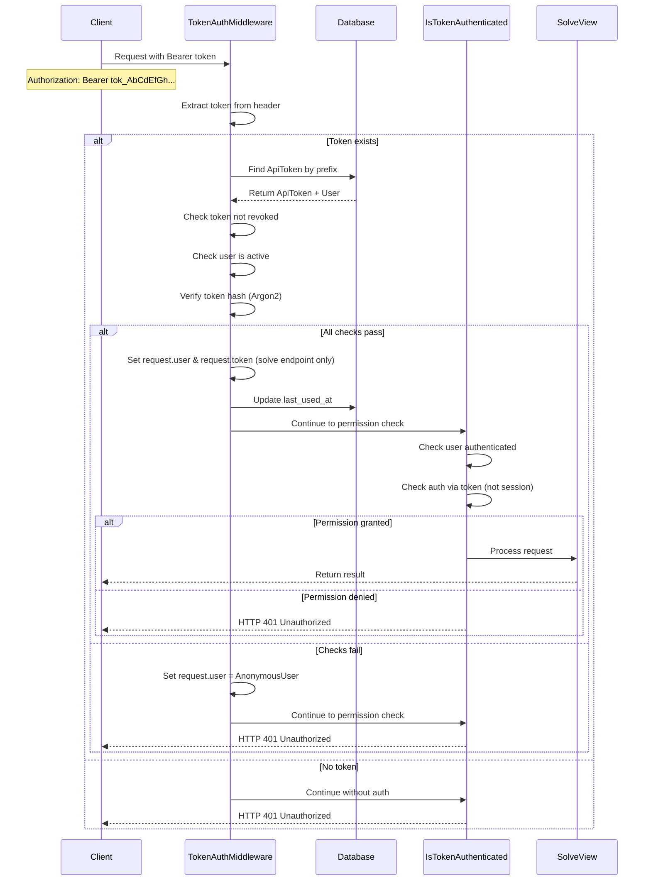

# API Token Authentication for Image Solver

## Overview

The image solver endpoint uses **API Token authentication** instead of regular session-based authentication. This allows programmatic access to the solver service without requiring a normal login flow. The authentication is handled through Bearer tokens in the HTTP Authorization header.

## Authentication Flow

### 1. Token Generation

Users must first generate an API token through the authenticated web interface:

1. User logs in normally through the web UI (session-based auth)
2. User must have a verified email address 
3. User creates a new API token via POST to `/api/customers/tokens`
4. The system generates a secure token with:
   - **Full token**: `tok_` + 40 random characters (e.g., `tok_AbCdEfGhIjKlMnOpQrStUvWxYz1234567890...`)
   - **Token prefix**: First 12 characters (e.g., `tok_AbCdEfGh`)
   - **Token hash**: Argon2 hash of the full token stored in database

### 2. Token Structure

```python
# From customers/models.py
class ApiToken(models.Model):
    user = models.ForeignKey(User, ...)
    name = models.CharField(max_length=100)
    token_prefix = models.CharField(max_length=12)  # tok_ + 8 chars for lookup
    token_hash = models.CharField(max_length=255)   # Argon2 hash for verification
    created_at = models.DateTimeField(auto_now_add=True)
    revoked_at = models.DateTimeField(null=True)    # If set, token is revoked
    last_used_at = models.DateTimeField(null=True)  # Updated on each use
```

### 3. Authentication Middleware

The `TokenAuthMiddleware` (located in `core/middleware/token_auth.py`) processes every request:

```python
def _authenticate_token(self, token: str) -> tuple[User | None, ApiToken | None]:
    # 1. Extract token prefix (first 12 chars)
    if not token.startswith("tok_"):
        return None, None
    
    token_prefix = token[:12]
    
    # 2. Find token by prefix (efficient database lookup)
    api_token = ApiToken.objects.select_related("user").get(token_prefix=token_prefix)
    
    # 3. Security checks
    if api_token.is_revoked:           # Check if token is revoked
        return None, None
    
    if not api_token.user.is_active:   # Check if user is active
        return None, None
    
    # 4. Verify token hash (using Argon2)
    self.ph.verify(api_token.token_hash, token)
    
    # 5. Update last used timestamp
    api_token.update_last_used()
    
    return api_token.user, api_token
```

### 4. Permission Classes

The solver endpoint uses the `IsTokenAuthenticated` permission class:

```python
class IsTokenAuthenticated(permissions.BasePermission):
    def has_permission(self, request: Request, view: APIView) -> bool:
        # 1. Check if user is authenticated
        user = get_authenticated_user(request)
        if user is None:
            return False
        
        # 2. Check if authentication was via token (not session)
        return hasattr(request, "token") and getattr(request, "token", None) is not None
```

## Security Requirements

### Required Checks for Token Authentication:

1. **Token Format Validation**
   - Token must start with `tok_`
   - Token must have correct length and format

2. **Token Status Checks**
   - Token must exist in database
   - Token must NOT be revoked (`revoked_at` must be null)
   - Token hash must match (Argon2 verification)

3. **User Status Checks**
   - User must exist
   - User must be active (`is_active = True`)
   - User must have verified email (`email_verified_at` is not null)

4. **Request Context**
   - Authentication must be via token, not session
   - Token is attached to request for logging purposes

## Authentication Process Flow Diagram



## Code Examples

### Creating an API Token

```python
# First, authenticate normally and create a token
import requests

# 1. Login to get session
login_response = requests.post(
    "https://api.example.com/api/customers/login",
    json={"email": "user@example.com", "password": "password"}
)
session = login_response.cookies

# 2. Create API token
token_response = requests.post(
    "https://api.example.com/api/customers/tokens",
    json={"name": "My Solver Token"},
    cookies=session
)

# The token is only shown once!
api_token = token_response.json()["token_once"]
print(f"Save this token: {api_token}")
```

### Using the Token to Call the Solver

```python
import requests

# The token you saved from creation
api_token = "tok_AbCdEfGhIjKlMnOpQrStUvWxYz1234567890..."

# Prepare the image
with open("math_problem.jpg", "rb") as f:
    image_data = f.read()

# Call the solver with Bearer authentication
response = requests.post(
    "https://api.example.com/api/core/solve",
    files={"file": ("math.jpg", image_data, "image/jpeg")},
    headers={
        "Authorization": f"Bearer {api_token}"
    }
)

if response.status_code == 200:
    result = response.json()
    print(f"Solution: {result['result']}")
    print(f"Request ID: {result['request_id']}")
else:
    print(f"Error: {response.status_code} - {response.json()}")
```

### Alternative: Binary Upload

```python
# For direct binary upload
response = requests.post(
    "https://api.example.com/api/core/solve",
    data=image_data,
    headers={
        "Authorization": f"Bearer {api_token}",
        "Content-Type": "application/octet-stream"
    }
)
```

## Error Responses

### Authentication Failures

When authentication fails, the client receives:

```json
{
    "detail": "Authentication credentials were not provided.",
    "status": 401
}
```

Common causes:
- Missing Authorization header
- Invalid token format
- Token revoked
- User account disabled
- Email not verified

### Token Management

Users can manage their tokens through the API:

```python
# List all tokens
GET /api/customers/tokens

# Revoke a token
DELETE /api/customers/tokens/{token_id}
```

## Important Security Notes

1. **Token Storage**: Tokens are shown only once during creation. The full token is never stored in the database, only its hash.

2. **Token Prefix**: The prefix (first 12 chars) is used for efficient database lookups while the full token is verified using Argon2.

3. **Revocation**: Tokens can be revoked but not deleted, maintaining an audit trail.

4. **Usage Tracking**: Each token usage is logged with:
   - Request details (RequestLog)
   - Billing information
   - Last used timestamp

5. **Email Verification**: Unlike regular login which may allow unverified emails temporarily, token authentication strictly requires email verification.

## Implementation Details

### Key Files

- **Token Model**: `customers/models.py` - ApiToken class
- **Middleware**: `core/middleware/token_auth.py` - TokenAuthMiddleware
- **Permissions**: `core/permissions.py` - IsTokenAuthenticated
- **View**: `core/views.py` - SolveView
- **Token Management**: `customers/views.py` - ApiTokenView

### Database Indexes

The token_prefix field is indexed for fast lookups:

```python
class Meta:
    indexes = [
        models.Index(fields=["token_prefix"]),
    ]
```

This ensures efficient authentication even with many tokens in the database.
